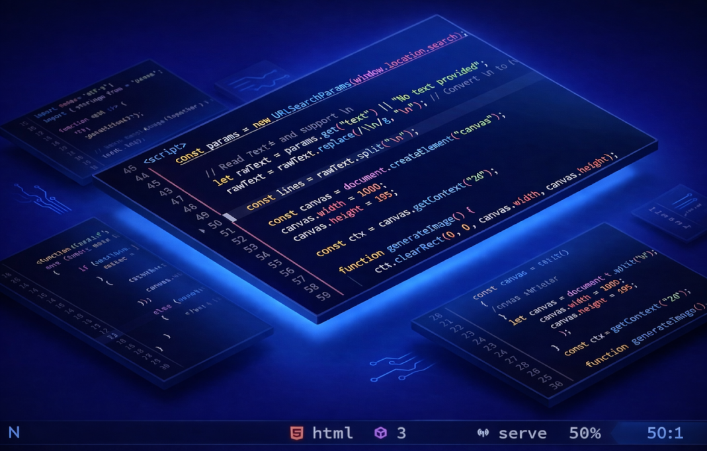

liveserver.nvim lets you run and manage live-server directly in Neovim. Start, stop, and switch servers with commands or a clickable lualine toggle. Lightweight, fast, and multi-server ready, perfect for web dev workflows.

---

## ✨ Features
- 🚀 Start and stop **liveserver** directly from Neovim  
- ⚙️ Full support for all live-server CLI arguments (`key=val` format)  
- 📁 Per-directory server instances  
- 🔢 Multi-server support (run multiple ports simultaneously)  
- 🎯 Smart default behavior (port 8080, current directory)  
- 📊 Clickable lualine toggle component  
- 🖱 Mouse/touch interaction support in statusline  
- 🔍 Interactive server selector (`LiveServerSelect`)  
- 🧭 Quick actions: open workspace, stop server, or cancel  
- 🎨 Customizable lualine states (icons, colors, text)  
- 🧩 Filetype-based lualine visibility  
- ⚡ Lightweight and fast

## Installation

1. Install [live-server](https://www.npmjs.com/package/live-server) node package globally.
2. Install with lazy.nvim:

```lua
require('lazy').setup {
    {
        'ankushbhagats/liveserver.nvim',
        build = 'npm i -g live-server',
        opts = {
          colortype = "hex", -- hex | hl
          args = { -- accepts live-server cli arguments.
            port = 8080,
            ["no-browser"] = true,
            -- filetypes = "*", -- show lualine component for all files.
            -- ... add more ...
          },
        },
        config = true
    }
}
```

---

<details>
<summary>Default Configuration</summary>

```lua
require("liveserver").setup({
  filetypes = { -- specify files to show lualine toggle button. set: "*" to allow all files.
    html = true,
    css = true,
    javascript = true,
    typescript = true,
  },
   args = { -- this table hold actual ARGS of liveserver program.
      port = 5555,
      host = "127.0.0.1",
      ["no-browser"] = false, -- set true to prevent auto opening the browser.
      watch = "*.html,*.css,*.js", -- automatically reload browser for specified files.
    },
  colortype = "hl", -- "hl" | "hex"
  states = { -- default state config
    idle = {
      icon = "",
      color = { -- hex colors only.
        fg = "#aaddff",
        bg = nil,
      },
      hl = { -- fg/bg: 1st value is the highlight group name, 2nd is hl value field to use.
        fg = { "lualine_a_normal", "bg" },
        bg = { "lualine_c_normal", "bg" },
      },
      text = "serve",
      gui = "bold",
    },
    start = {
      icon = "󰐰",
      color = {
        fg = "#ffee55",
        bg = nil,
      },
      hl = {
        fg = { "lualine_a_command", "bg" },
        bg = { "lualine_c_normal", "bg" },
      },
      text = "starting…",
      gui = "bold",
    },
    stop = {
      icon = "",
      color = {
        fg = "#fc5600",
        bg = nil,

      },
      hl = {
        fg = { "lualine_a_replace", "bg" },
        bg = { "lualine_c_normal", "bg" },
      },
      text = "stopping…",
      gui = "bold",
    },
    running = {
      icon = "",
      color = {
        fg = "#fc5600",
        bg = nil,
      },
      hl = {
        fg = { "lualine_a_replace", "bg" },
        bg = { "lualine_c_normal", "bg" },
      },
      text = "port:",
      gui = "bold",

    },
 },
})
```
</details>

---

## Commands

#### `:LiveServerStart [dir] [key=val ...]`

Start a live-server instance.

- Uses **current directory** if no path is provided.
- Uses **port 8080** if no args are provided.
- Supports **all liveserver CLI params** as:

```sh
:LiveServerStart ./public port=3000 host=127.0.0.1 no-browser=true
```

#### :LiveServerStop [port]
Stop a running server.
Stops port 8080 by default.
Can stop any port:
```sh
:LiveServerStop 3000
```

#### :LiveServerSelect
Interactive selector for running servers.
Workflow:
1. Opens selection menu of active servers.
2. After selection shows confirmation prompt:
- Open Workspace
- Stop Port
- Cancel

## Lualine Integration
Shows a **liveserver toggle button** in your statusline.

- Clickable with mouse/touch  
- Scoped per directory  
- Displays current server state  

| State     | Meaning                         |
|-----------|---------------------------------|
| Idle      | Server not running              |
| Starting  | Server launching                |
| Running   | Server active (shows port)      |
| Stopping  | Server shutting down            |

---
 
### ❤️ Contributing

Feel free to open issues or submit PRs to improve themes, add integrations, or enhance features.

---

### 📄 License
GNU General Public License v3
